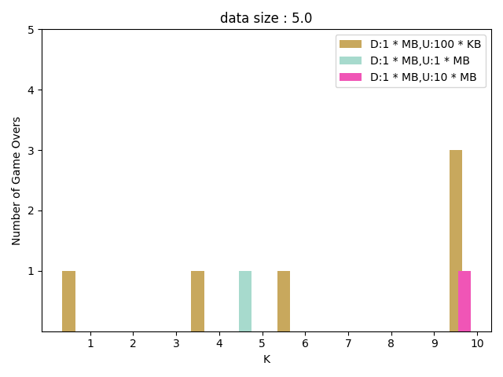
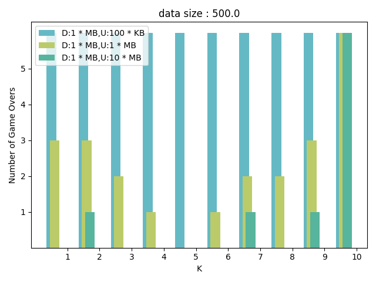
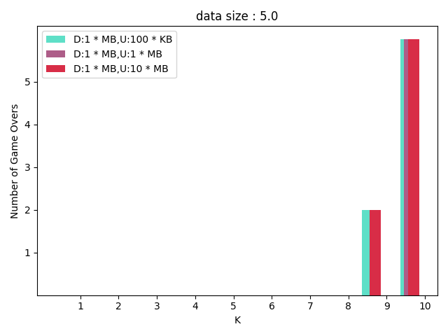
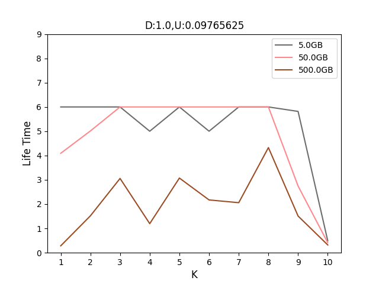

# erasure_code_sim
erasure coding simulation
The project support both 1 block per server and N block per server.

Development Enviroment:
* VsCode
* Python 3.9
* Dependencies
  * matplotlib
  * networkx-2.2
  * numpy

Configurable option through constant.py:
* Number of server
* Number of Block
* k
* Download speed
* Upload speed
* list of Data Size
* Number of iteration

1 block per server:

  

10 block per server:

